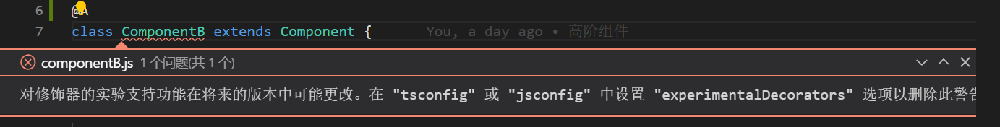
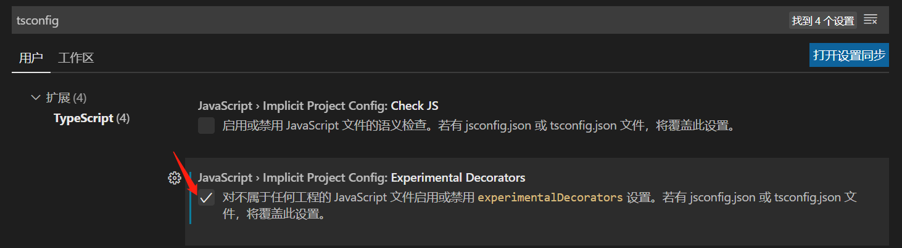

## React 中高阶函数与高阶组件

## 快速导航

<TOC />

## 前言

React 中最大的一亮点,就是组件化开发模式,而编写 React 组件,对于无状态的组件,我们可以用函数式组件编写,而复杂的组件(聪明组件/外层组件)可以用类`class`编写组件

在 React 中提到了高阶函数与高阶组件,一直以来,对它们都是持以仰望的,逼格高的词调,常常把自己给整晕的,做个记录总结一下的

## 什么是高阶函数?

### 函数可以被作为参数传递

如下:经常用到的`setTimeout`,`setInterval`
:::: tabs type:border-card
::: tab setTimeout 高阶函数 lazy

```js
setTimeout(function() {
  console.log('itclanCoder');
}, 2000);
```

`setTimeout` 是一个定时器函数,接收两个参数,第一个参数是一个匿名函数,第二个参数是时间
过了 2 秒后,执行匿名函数中的代码
:::
::: tab setInterval 高阶函数 lazy

```js
setInterval(() => {
  console.log('http://coder.itclan.cn');
}, 2000);
```

`setTinterval` 是一个定时器函数,同样接收两个参数,第一个参数是箭头函数,每个参数时间参数
每隔 2 秒执行一次箭头函数
:::
::: tab 说明 lazy
类似这样的高阶函数:`clearInterval` 清除定时器等,**将函数作为形参数放到一个函数中执行的,这个函数可以视为高阶函数**
数组中的一些迭代器函数都可以视为高阶函数:`map`,`filter`,`forEach`,`reduce`,`find`等
:::
::::

### 函数作为返回值输出

一个函数可以有返回值,也可以无返回值,若无指定返回值,它会默认返回`undefined`

函数是对象,这意味着函数可以存储在一个变量,数组,或对象中,同时函数可以传递给函数,并由函数返回,它可以拥有属性,也可以是一个值,可以像`JavaScript`中的其他表达式那样被当做参数一个传递

```js
function foo(x) {
  return function() {
    return x;
  };
}
```

上面的 foo 函数接收的形参是`x`,函数 foo 的返回值是一个匿名函数,匿名函数返回值返回形参`x`

那么此时`foo`函数就是以函数作为返回值作为输出的高阶函数

### 高阶函数应用

:::: tabs type:border-card
::: tab 定时器 setTimeout 应用 lazy

```js
setTimeout(function() {
  console.log('itclanCoder');
}, 2000);
```

隔 2 秒后打印 itclancoder
:::
::: tab 定时器 setInterval 应用 lazy

```js
setInterval(function() {
  console.log('http://coder.itclan.cn/');
}, 2000);
```

每隔 2 秒打印一次`http://coder.itclan.cn/`
:::
::: tab Ajax 应用 lazy

```js
$.get('url?params',function() {
  console.log("获取数据");
})

axios.get('url', function() {
    console.log("获取数据");
})
...
```

上面的`get`函数都可以视为高阶函数
:::
::: tab Es5-Es5 新增的一个迭代器方法 lazy

```js
some(),every(),map(),forEach(),reduce(),find(),filter()等
```

:::
::: tab 函数节流应用 lazy

```js
function throttle2(method, duration) {
  // 当前时间间隔内是否有方法执行,设置一个开关标识
  var runFlag = false;
  // 返回一个事件处理函数
  return function(e) {
    // 判断当前是否有方法执行,有则什么都不做,若为true,则跳出
    if (runFlag) {
      return false;
    }
    // 开始执行
    runFlag = true;
    // 添加定时器,在到达时间间隔时重置锁的状态
    setTimeout(function() {
      method(e);
      // 执行完毕后,声明当前没有正在执行的方法,方便下一个时间调用
      runFlag = false;
    }, duration);
  };
}
```

函数节流保证一段时间内只执行一次核心代码,连续每隔一定的时间触发执行的函数
上面使用的是重置一个开关变量+定时器的方式实现函数节流
:::
::: tab 函数防抖应用 lazy

```js
function debounce(method, duration) {
  var timer = null;
  return function() {
    var that = this,
      args = arguments;
    // 在本次调用之间的一个间隔时间内若有方法在执行,则终止该方法的执行
    if (timer) {
      clearTimeout(timer);
    }
    // 开始执行本次调用
    timer = setTimeout(function() {
      method.apply(that, args);
    }, duration);
  };
}
```

函数的防抖:延迟事件处理函数的执行,一定时间间隔内只执行最后一次操作
:::
::: tab 函数柯里化 lazy

```js
// 普通的add函数
function add(x, y) {
  return x + y;
}

// 柯里化后
function curryingAdd(x) {
  return function(y) {
    return x + y;
  };
}

add(1, 2); // 3
curryingAdd(1)(2); // 3
```

以上是把`add`函数的`x`，`y`两个参数变成了先用一个函数接收`x`然后返回一个函数去处理`y`参数

只传递给函数一部分参数来调用它，让它返回一个函数去处理剩下的参数。
:::
::::

## 高阶组件

**概念**: 高阶组件就是接收一个组件作为参数并返回一个新组件的函数
**说明**: 高阶组件是一个函数,并不是组件

例如:如下面的弹出框

<template>
   <div class="highfun-component-pop">
        <div class="highfun-component-pop-box">
             <div class="header">
                  <div>提示</div>
                  <div><i class="el-icon-circle-close icon-close-btn"></i></div>
             </div>
             <div class="content">
                     <div class="list">A</div>
                     <div class="list">B</div>
                     <div class="list">C</div>
                     <div class="list">D</div>
                     <div class="list">E</div>
             </div>
        </div>
        <div class="highfun-component-pop-box">
              <div class="header">
                  <div>提示</div>
                  <div><i class="el-icon-circle-close icon-close-btn"></i></div>
             </div>
             <div class="content2">
                    <div class="list2">A</div>
                    <div class="list2">B</div>
                    <div class="list2">C</div>
                    <div class="list2">D</div>
             </div>
        </div>
   </div>
</template>
<script>
export default {
  data() {
    return {

    }

},

}
</script>

<style>
.highfun-component-pop {
  display: flex;
  justify-content: center;
}

.highfun-component-pop .highfun-component-pop-box {
  width: 300px;
  height: 400px;
  border:1px solid #de3636;
  border-top: none;
}

.highfun-component-pop .highfun-component-pop-box:nth-child(1) {
  margin-right: 30px;
}

.highfun-component-pop .highfun-component-pop-box .header {
  display: flex;
  height: 50px;
  padding: 0 10px;
  justify-content: space-between;
  align-items: center;
  background:#de3636;
  color:#fff;
}

.highfun-component-pop .highfun-component-pop-box .header .icon-close-btn {
  font-size: 25px;
  color:#fff;
}
.highfun-component-pop .highfun-component-pop-box .content {
  display: flex;
  justify-content: center;
  flex-direction: column;
  align-items: center;
  align-content: center;
}

.highfun-component-pop .highfun-component-pop-box .content2 {
  display: flex;
  flex-wrap: wrap;
  justify-content: center;
}

.highfun-component-pop .highfun-component-pop-box .list2{
  width: 100px;
  height: 100px;
  border:1px solid #de3636;
  margin: 10px;
  text-align: center;
  line-height: 100px;
}

.highfun-component-pop .highfun-component-pop-box .list {
  width: 80%;
  height: 40px;
  border: 1px solid #de3636;
  margin: 10px 0;
  text-align:center;
  line-height: 40px;
}
</style>

经过 UI,可以将上面的公共的部分以及不同的部分给提取出来,封装成三个组件,分别为组件 A(公共部分),组件 B,组件 C

<template>
    <div class="highcompnent-demo-wrap">
        <div class="component-a">
            <div class="component-header">
                  <div>提示</div>
                  <div><i class="el-icon-circle-close icon-close-btn"></i></div>
             </div>
        </div>
        <div class="component-b">
            <div class="list">A</div>
            <div class="list">B</div>
            <div class="list">C</div>
            <div class="list">D</div>
            <div class="list">E</div>
        </div>
        <div class="component-c">
              <div class="component-list">A</div>
              <div class="component-list">B</div>
              <div class="component-list">C</div>
              <div class="component-list">D</div>
        </div>
    </div>
</template>

<style>
.highcompnent-demo-wrap {
     display: flex;
     justify-content: center;

}

.highcompnent-demo-wrap .component-a {
width: 300px;
height: 400px;
border:1px solid #de3636;
border-top: none;
}

.highcompnent-demo-wrap .component-b {
  width: 300px;
  height: 400px;
  display: flex;
  justify-content: center;
  flex-wrap: wrap;
}

.highcompnent-demo-wrap .component-b .list {
  width: 80%;
  height: 40px;
  border: 1px solid #de3636;
  margin: 10px 0;
  text-align:center;
  line-height: 40px;
}

.highcompnent-demo-wrap .component-c {
  display: flex;
  justify-content: center;
  flex-wrap: wrap;
  align-items: center;
  align-content: center;
  width: 226px;
  height: 400px;
}

.highcompnent-demo-wrap .component-c .component-list {
  width: 100px;
  height: 100px;
  border:1px solid #de3636;
  text-align: center;
  line-height: 100px;
  margin-right: 10px;
  margin-bottom:10px;
}

.highcompnent-demo-wrap .component-header {
display: flex;
height: 50px;
padding: 0 10px;
justify-content: space-between;
align-items: center;
background:#de3636;
color:#fff;
}
</style>
<template>
    <div class="footer-component">
         <div>组件A</div>
         <div>组件B</div>
         <div>组件C</div>
    </div>
</template>
<style>
.footer-component {
  padding: 15px 0 0 0;
  width: 100%;
  display: flex;
  justify-content: space-around;
  
}

</style>

可以用`create-react-app`脚手架工具创建一个项目,在`src`目录下创建一个`components`文件夹,这个文件主要用于存放我们的自定义组件

在`components`中创建一个`highcomponent`,同时在该文件夹内创建`ComponentA.js`,`ComponentB.js`,`ComponentC.js`

:::: tabs type:border-card
::: tab 组件 A 公共组件 lazy

```js
import React, { Component } from 'react';
import ReactDOM from 'react-dom';
import './componentA.css';

// 声明一个函数A组件,返回结果是一个类组件,并接收一个参数WrappendComponent
function A(WrappendComponent) {
  return class ComponentA extends Component {
    render() {
      return (
        <div>
          <div className="highfun-component-pop-box">
            <div className="header">
              <div>提示</div>
              <div>X</div> // 这里为了简便,我直接用一个x替代了的
            </div>
            <div className="content">
              <WrappendComponent /> // 这里是要渲染不同的内容
            </div>
          </div>
        </div>
      );
    }
  };
}

export default A; // 导出A函数组件
```

:::
::: tab 组件 B lazy

```js
import React, { Component } from 'react';
import ReactDOM from 'react-dom';
import './componentB.css';
import A from './componentA'; // 引入A函数

// 类声明B组件
class ComponentB extends Component {
  render() {
    return (
      <div>
        <div className="component-b">
          <div className="list">A</div>
          <div className="list">B</div>
          <div className="list">C</div>
          <div className="list">D</div>
        </div>
      </div>
    );
  }
}

export default A(ComponentB); // 导出调用A函数,同时将B组件让A组件作为参数调用
```

:::
::: tab 组件 C lazy

```js
import React, { Component } from 'react';
import ReactDOM from 'react-dom';
import './componentC.css';
import A from './componentA';

class ComponentC extends Component {
  render() {
    return (
      <div>
        <div className="component-c">
          <div className="component-list">A</div>
          <div className="component-list">B</div>
          <div className="component-list">C</div>
          <div className="component-list">D</div>
        </div>
      </div>
    );
  }
}

export default A(ComponentC);
```

:::
::: tab App.js 中 lazy

```js
import React, { Component } from 'react';
import ReactDOM from 'react-dom';

import ComponentB from './components/highfun-component-popcomponent/componentB';
import ComponentC from './components/highfun-component-popcomponent/componentC';

import './App.css';

class App extends Component {
  constructor(props) {
    super(props);
  }

  render() {
    return (
      <div className="App">
        <ComponentB />
        <ComponentC />
      </div>
    );
  }
}

export default App;
```

:::
::: tab 说明 lazy
从上面的示例代码中就可以看出 A 就是一个高阶组件

⒈ 首先高阶组件它是一个函数,并且函数返回一个类组件

⒉ 高阶组件它需要接受一个形参数,作为在想要渲染地方以组件的形式插入
:::
::::
经过上面的代码编写:达到了组件复用的目的

<div align="center">
   
</div>

## 为什么需要高阶组件

多个组件都需要某个相同的功能,使用高阶组件减少重复实现

`react-redux` 中的`connect`连接器就是一个高阶组件

```js
export default connect(mapStateToProps, mapDispatchToProps)(Header);
```

## 高阶组件的实现

⒈ 如何编写高阶组件
⒉ 如何使用高阶组件
⒊ 如在高阶组件中实现传递参数

### 如何编写高阶组件

⒈ 实现一个普通组件
⒉ 将一个普通组件使用函数包裹

:::: tabs type:border-card
::: tab 第 1 步实现一个普通组件 lazy

```js
import React, { Component } from 'react';
// 用class类声明一个componentD组件继承自Component
export default class componentD extends Component {
  render() {
    return <div></div>;
  }
}
```

:::
::: tab 第 2 步-将普通组件使用函数包裹 lazy

```js
import React, { Component } from 'react';
// 声明一个函数组件ComponentD,同时接收一个形参WrappedComponent
function ComponentD(WrappedComponent) {
  return class componentD extends Component {
    render() {
      return (
        <div>
          <WrappedComponent />
        </div>
      );
    }
  };
}

export default ComponentD;
```

:::
::: tab 说明 lazy
编写一个高阶组件,首先要明确高阶组件是一个函数

⒈ 先编写一个普通的类组件

⒉ 声明一个函数,接收一个形参,该函数返回一个类组件

⒊ 最后将该函数给导出
:::
::::

### 如何使用高阶组件

⒈ higherOrderComponent(WrappedComponent)

⒉ @highOrderComponent

假设现在我编写了一个组件`compnentF.js`组件,将该组件当做参数传递给组件 componentD,然后渲染到页面上

以下为第一种使用方式,函数调用方式
:::: tabs type:border-card
::: tab 组件 F-componentF lazy

```js
import React, { Component } from 'react';
import componentD from './componentD'; // 引入函数componentD高阶组件

class componentF extends Component {
  render() {
    return <div>我是组件F</div>;
  }
}

export default componentD(componentF); // 将类组件componentF作为参数被组件componentD调用并导出
```

:::
::::
使用高阶组件,还有另外一种方式,就是使用装饰器方式,即`@+函数名`,它是一个语法糖,简化了我们的写法

### 方式 1-安装 babel 插件在 babelrc 中配置

在使用这种装饰器方式时,需要对`create-react-app`做一些配置,它默认是不支持装饰器模式的,你需要对项目做一些配置

在`create-react-app`根目录中终端下使用`npm run eject`,这条命令主要是将我们的配置项做一个反向输出,暴露出隐藏的 webpack 配置项,这样可以项目进行修改了的,注意它是不可逆的

使用装饰器模式时:需要安装两个依赖:

```js
cnpm install -D babel-preset-stage-2
cnpm install -D babel-preset-react-native-stage-0
```

然后你需要在根目录下创建一个`.babelrc`文件,对`.babelrc`文件做一些配置

```js
{
  "presets": ["react-native-stage-0/decorator-support"]
}
```

经过这么配置后,就可以使用装饰器了的

```js
import React, { Component } from 'react';
import componentD from './componentD'; // 引入函数componentD高阶组件

@componentD // 直接用@符号+高阶组件componentD就可以了的
class componentF extends Component {
  render() {
    return <div>我是组件F</div>;
  }
}

export default componentF;
```

### 方式 2-经过 eject 后在 package.json 中的 plugins 中配置

当用`eject`将`webpack`一些配置弹射出来以后,会看到根目录下的`package.json`文件下新增了很多文件

在`babel`对象处进行插件的配置,将`@babel/plugin-proposal-decorators`添加到`plugins`后

```js
{
  "babel": {
    "presets": [
      "react-app"
    ],

    "plugins": [
        [
            "@babel/plugin-proposal-decorators",
            { "legacy": true }
        ]
    ]

  }
}
```

:::: tabs type:border-card

::: tab 出现警告提示
当使用装饰器模式时,在 vscode 中会有一警告的提示

<div align="center">
   
</div>
:::
::: tab 解决 vscode 警告问题 lazy
在vscode中的设置中`tsconfig`启动`Experimental Decorators`就可以解决此警告
<div align="center">
   
</div>
:::
::::

经过这么配置后就可以使用装饰模式模式了的-即`@+函数名`简写的方式
:::: tabs type:border-card
::: tab 非装饰器普通模式写法 lazy

```js
import React, { Component } from 'react';
import './componentB.css';
import A from './componentA';

class ComponentB extends Component {
  constructor(props) {
    super(props);
  }

  render() {
    return (
      <div>
        <div className="component-b">
          <div className="list">A</div>
          <div className="list">B</div>
          <div className="list">C</div>
          <div className="list">D</div>
        </div>
      </div>
    );
  }
}

export default A(ComponentB); // 需要调用高阶组件
```

:::

::: tab 装饰器写法 lazy

```js
import React, { Component } from 'react';
import './componentB.css';
import A from './componentA';

@A
class ComponentB extends Component {
  constructor(props) {
    super(props);
  }

  render() {
    return (
      <div>
        <div className="component-b">
          <div className="list">A</div>
          <div className="list">B</div>
          <div className="list">C</div>
          <div className="list">D</div>
        </div>
      </div>
    );
  }
}

export default ComponentB; // 直接导出组件即可
```

:::
::: tab 说明 lazy
在同一个组件中可以组合使用高阶函数,能够无限的嵌套下去,如果不用装饰器函数,你会发现代码将变得非常难以理解,也不好维护

```js
import React, { Component } from 'react';
import A from './componentA';
import componentD from './componentD';

@A
@comonentD
class componentF extends Component {
  render() {
    return <div>我是组件F</div>;
  }
}

export default componentF;
```

:::
::::

::: tip 为什么需要 eject 暴露呢
因为默认`create-react-app`虽然已经内已经安装了 `@babel/plugin-proposal-decorators`插件,但是需要自己进行配置

若不进行配置,它是不支持装饰器模式的
:::

<footer-FooterLink :isShareLink="true" :isDaShang="true" />
<footer-FeedBack />
